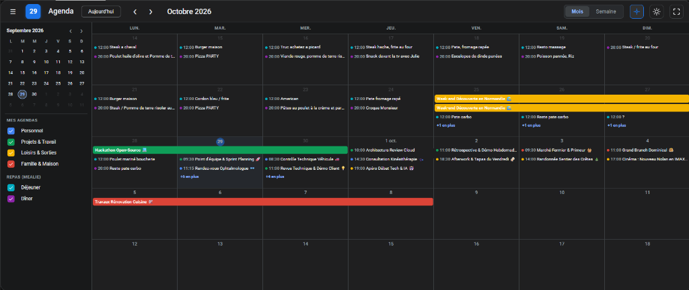
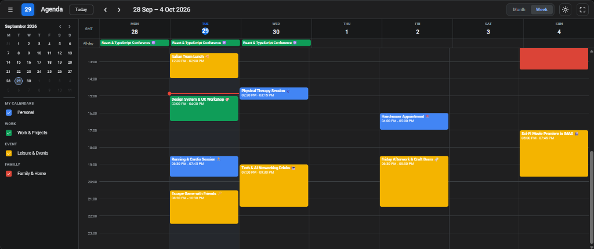
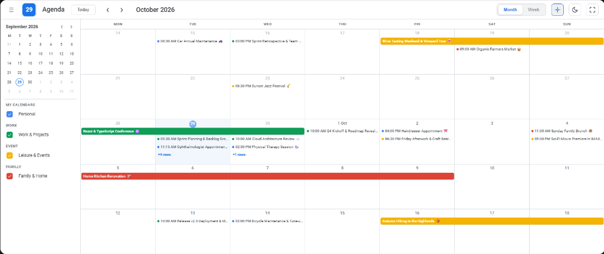
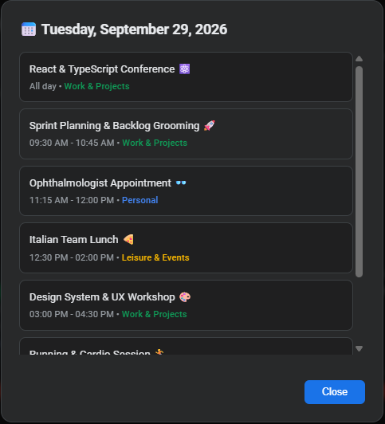

# Google Agenda Card for Home Assistant 📅

[](https://github.com/hacs/default)
[](https://github.com/Blackbol/ha-google-agenda-card)
[](https://opensource.org/licenses/MIT)

Une carte Lovelace personnalisée pour **Home Assistant** offrant l'interface complète, fluide et moderne de **Google Agenda** (Google Calendar) avec support complet du mode sombre et clair, vue semaine 24h, vue mois centrée, barres continues multi-jours, intégration Mealie pour les repas, et ergonomie optimisée pour tablettes et iPad.

---

## 📸 Aperçu

### Vue Mois (Mode Sombre)
*Barres multi-jours continues, pastilles colorées par calendrier, puces `+X en plus` et barre latérale rétractable.*


### Vue Semaine (Grille horaire 24h)
*Vue détaillée heure par heure avec repère d'heure actuelle et événements multi-jours en en-tête.*


### Vue Mois (Mode Clair)
*Prise en charge native du thème clair de Home Assistant avec contrastes optimisés.*


### Fiche Détail d'un Événement (Modale)
*Consultation des détails (horaires, calendrier source, localisation et description).*


---

## ✨ Fonctionnalités clés

- 🗓️ **Expérience Google Calendar authentique** : Vue Mois et vue Semaine (24h) avec début de semaine le **Lundi**.
- ↔️ **Barres d'événements multi-jours continues** : Les événements s'étendant sur plusieurs jours ou semaines forment une barre continue harmonieuse (exactement comme sur Google Calendar web/mobile).
- 🎯 **Option Vue Mois Centrée** : Permet de verrouiller la semaine actuelle sur la **ligne du milieu** (semaine 3 sur 5), pour visualiser toujours 2 semaines passées et 2 semaines à venir. Bouton d'activation rapide dans l'en-tête (icône cible 🎯).
- 🌓 **Thème Sombre & Clair Automatique** : Détection automatique du thème de Home Assistant ou du système, avec palettes de couleurs soignées et contrastes solides. Bouton bascule manuel disponible à tout moment.
- 🍽️ **Intégration Mealie / Repas (`fixed_time`)** : Convertit automatiquement les repas "toute la journée" en événements horaires précis (ex: Déjeuner à `12:00`, Dîner à `20:00`) sans modifier les données sources.
- 📱 **Optimisé Tablettes & iPad** : Rendu responsive `panel: true`, colonnes verrouillées en pourcentage strict pour éviter tout débordement de texte, et bouton **Plein Écran** intégré.
- 🔍 **Modales interactives et ordonnées** :
  - Clic sur `+X en plus` : ouvre la modale récapitulative du jour avec tri chronologique strict (événements journée, midi, soir).
  - Clic sur un événement : affiche sa fiche complète (horaires, calendrier source, localisation, description avec liens cliquables).
- 🎨 **Regroupement & Couleurs personnalisables** : Organisation des calendriers par catégories dans la barre latérale rétractable (ex: *Mes agendas*, *Autres agendas*, *Repas*).

---

## 📦 Installation

### Méthode 1 : Via HACS (Recommandé)

1. Ouvrez **HACS** dans votre interface Home Assistant.
2. Cliquez sur les **trois points verticaux** en haut à droite, puis sur **Dépôts personnalisés** (*Custom repositories*).
3. Ajoutez l'URL de votre dépôt GitHub :
   - **URL** : `https://github.com/Blackbol/ha-google-agenda-card`
   - **Type** : `Tableau de bord` (ou `Lovelace`)
4. Cliquez sur **Ajouter**.
5. Cherchez **Google Agenda Card** dans HACS et cliquez sur **Télécharger**.
6. Rafraîchissez votre navigateur (Ctrl + F5 ou vider le cache).

---

### Méthode 2 : Installation Manuelle

1. Téléchargez le fichier [`google-agenda-card.js`](google-agenda-card.js).
2. Copiez-le dans le dossier `www` de votre configuration Home Assistant (ex: `/config/www/google-agenda-card.js`).
3. Dans Home Assistant, allez dans **Paramètres** -> **Tableaux de bord** -> **Ressources** (3 points en haut à droite).
4. Cliquez sur **Ajouter une ressource** :
   - **URL** : `/local/google-agenda-card.js`
   - **Type de ressource** : `Module JavaScript`
5. Rafraîchissez votre tableau de bord.

---

## ⚙️ Configuration YAML

### Exemple complet (correspondant aux captures d'écran)

```yaml
type: custom:google-agenda-card
language: auto            # 'auto' (suit la langue HA), 'en' ou 'fr'
theme_mode: auto          # 'auto', 'dark' ou 'light'
centered_month: true      # Active la vue du mois centrée sur la semaine actuelle
fit_screen: true          # Ajuste la hauteur de la carte à l'écran
show_fullscreen_button: true

calendars:
  - id: calendar.personnel
    name: Personnel
    color: '#4285f4'
    group: Mes agendas
    default: true

  - id: calendar.travail_projets
    name: Projets & Travail
    color: '#0f9d58'
    group: Mes agendas
    default: true

  - id: calendar.loisirs_sorties
    name: Loisirs & Sorties
    color: '#f4b400'
    group: Mes agendas
    default: true

  - id: calendar.famille_maison
    name: Famille & Maison
    color: '#db4437'
    group: Mes agendas
    default: true

  # Optionnel : repas Mealie avec heures fixes automatiques
  - id: calendar.mealie_dejeuner
    name: Déjeuner
    color: '#00acc1'
    group: Repas (Mealie)
    fixed_time: '12:00'
    duration_minutes: 45
    default: true

  - id: calendar.mealie_diner
    name: Dîner
    color: '#8e24aa'
    group: Repas (Mealie)
    fixed_time: '20:00'
    duration_minutes: 45
    default: true
```

---

## 📋 Référence des Options

| Option | Type | Défaut | Description |
| :--- | :--- | :--- | :--- |
| `type` | `string` | **Requis** | `custom:google-agenda-card` |
| `calendars` | `list` | `[]` | Liste des entités calendriers Home Assistant à afficher |
| `language` | `string` | `auto` | Langue de l'interface : `auto` (suit le profil Home Assistant), `fr` (français) ou `en` (anglais) |
| `theme_mode` | `string` | `auto` | Mode de couleur : `auto` (suit Home Assistant), `dark` ou `light` |
| `centered_month` | `boolean` | `false` | Centre la vue mois pour que la semaine actuelle soit la 3ᵉ ligne (du milieu) |
| `fit_screen` | `boolean` | `true` | Adapte la hauteur pour remplir la vue écran de l'iPad/tablette |
| `card_height` | `string` | `calc(100vh - 215px)` | Hauteur CSS personnalisée (ex: `650px`, `100vh`) |
| `fullscreen` | `boolean` | `false` | Démarre la carte directement en plein écran |
| `show_fullscreen_button`| `boolean` | `true` | Affiche l'icône de passage en plein écran dans la barre d'outils |

### Options par calendrier (`calendars`)

| Clé | Type | Description |
| :--- | :--- | :--- |
| `id` | `string` | **Requis** : Identifiant de l'entité Home Assistant (ex: `calendar.personnel`) |
| `name` | `string` | Nom affiché dans la barre latérale et sur les événements |
| `color` | `string` | Couleur hexadécimale de la pastille et des barres (ex: `#1a73e8`) |
| `group` | `string` | Nom de la catégorie dans la barre latérale (ex: `Mes agendas`) |
| `fixed_time` | `string` | *(Optionnel)* Force l'affichage d'un événement journée à une heure précise `HH:MM` (ex: `12:00`) |
| `duration_minutes` | `number` | *(Optionnel)* Durée en minutes lors de l'utilisation de `fixed_time` (défaut : `60`) |
| `default` | `boolean` | Définit si le calendrier est coché par défaut à l'ouverture (`true`) |

---

## 📄 Licence

Ce projet est sous licence MIT - voir le fichier [LICENSE](LICENSE) pour plus de détails.
